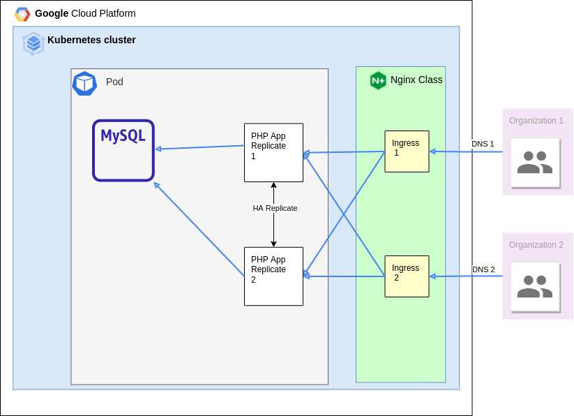

# Case Study
- To complete case study on Pulumi and GitHub Action CI in GCP

### Prerequisites

- Pulumi
- Google Cloud SDK with configuration
    * Login using `gcloud`

        ```bash
        $ gcloud auth login
        $ gcloud config set project <YOUR_GCP_PROJECT_HERE>
        $ gcloud auth application-default login
        ```
- Node.js

### Architecture diagram


### Pulumi - GKE

1. Change directory into Pulumi project
    ```bash
    cd Pulumi/casestudy-gke
    ```
1. ```bash
    npm install
    ```
1. ```bash
    pulumi stack init
    ```
1.  Setup your GCP environment
    ```bash
    pulumi config set gcp:project <YOUR_GCP_PROJECT_HERE>
    pulumi config set gcp:zone asia-southeast2-b    // GCP Zone
    ```
1.  run Pulumi
    ```bash
    pulumi up -y
    ```
1.  get kubeconfig file and export
    ```bash
    pulumi stack output kubeconfig --show-secrets > kubeconfig
    export KUBECONFIG=$PWD/kubeconfig
    ```
1.  get nginx's ip
    ```bash
    kubectl get svc -n ingress-nginx ingress-nginx-controller
    ```

1.  Edit hosts file to nginx's IP
    ```bash
    sudo vim /etc/hosts
    ```
    ```
    ***nginx's ip here***   sd.org1.casestudy
    ***nginx's ip here***   sd2.org2.casestudy
    ```
1.  Access address with browser  **[sd.org1.casestudy](http://sd.org1.casestudy)**   **[sd2.org2.casestudy](http://sd2.org2.casestudy)**
    
### Gitlab Actions
###### Prerequisites - add github actions secret
-   Add `GKE_PROJECT` with GCP's project id
-   Add `SERVICE_ACCOUNT_KEY` with GCP's service account json key
    - with storage admin permission
    - with kubernetes engine developer permission
-   Update cluster name in `gke.yaml`

1. Building new docker image
    -   Gitlab Action build new docker image 
    -   Trigger every pull-request to main branch
    -   auto increment
    -   step written in `main-ci.yml`

2. Deploying new docker image into kubernetes cluster
    -   Gitlab Action apply deployment to k8s cluster
    -   Trigger manually
    -   step in `gke.yaml`